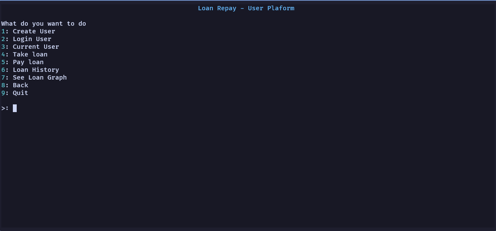
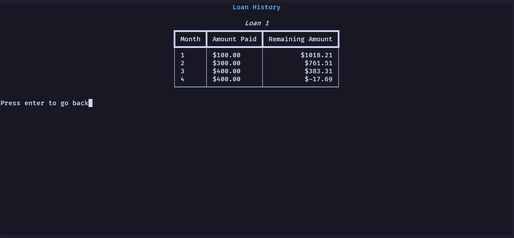
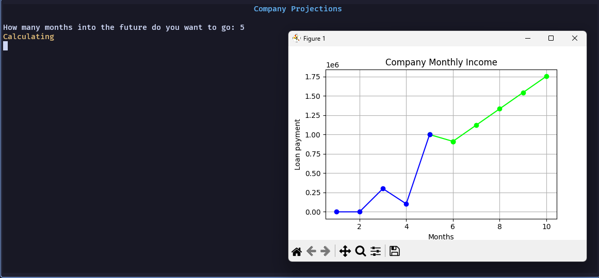

# loanrepay

This is a loan repayment calculator that calculates the amount individuals would pay each month with interest added. It would also predict the amount that the Loan Company would get in a specified couple of months using Linear Regression.

## How to Run

1. Install [Rye](https://rye-up.com/guide/installation/).
2. Run `rye sync` in the project.
3. Run `rye run main` to run the project.
4. Enjoy

## Screenshots

### 
Main Menu

### 
User Menu

### 
Loan History

### 
Projections

